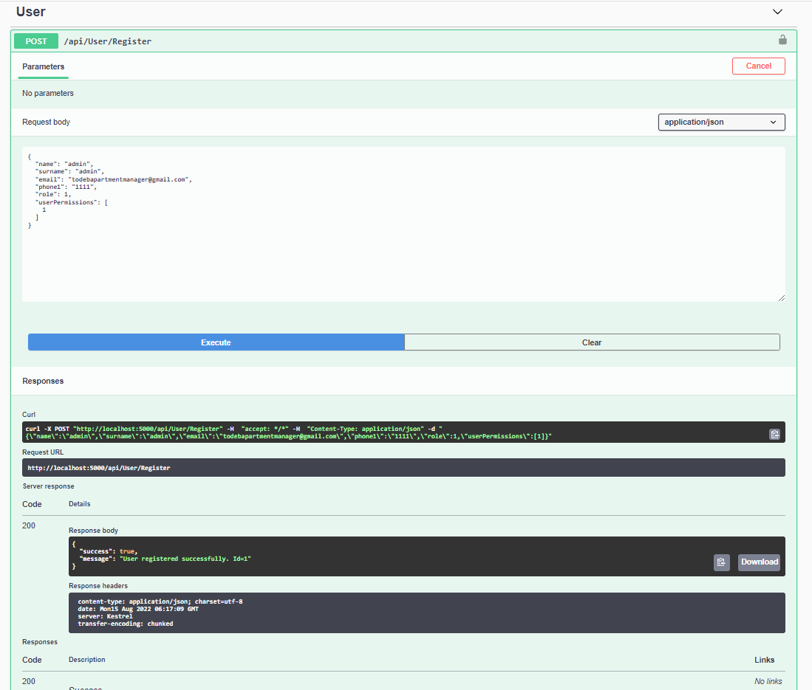
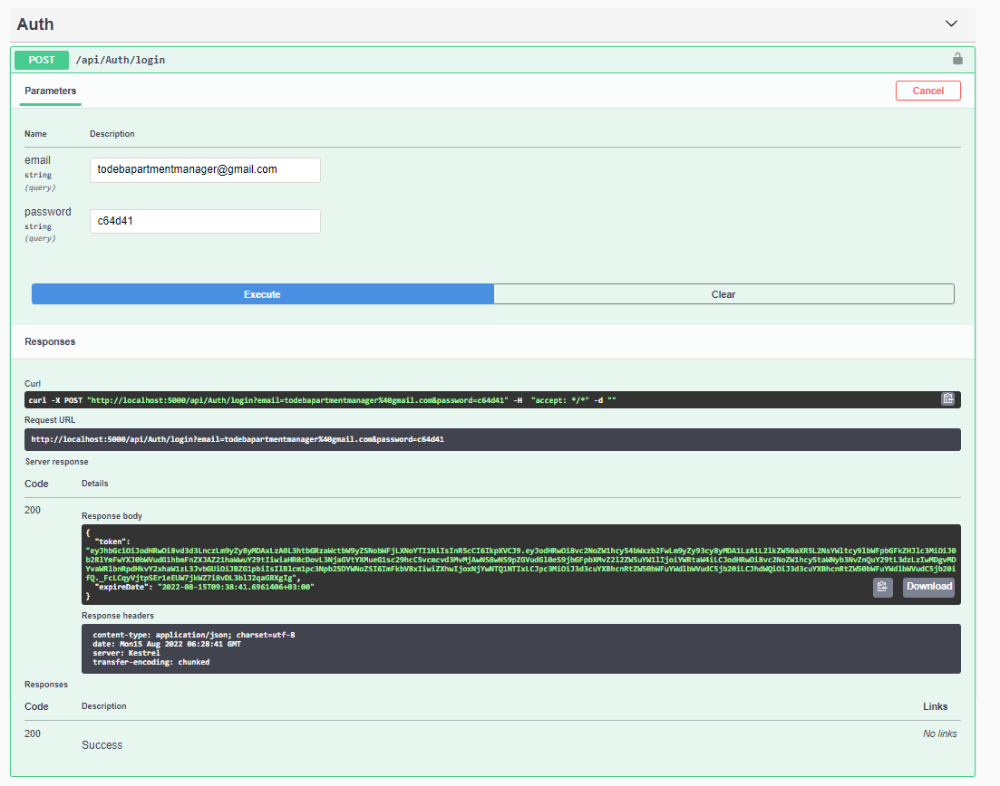
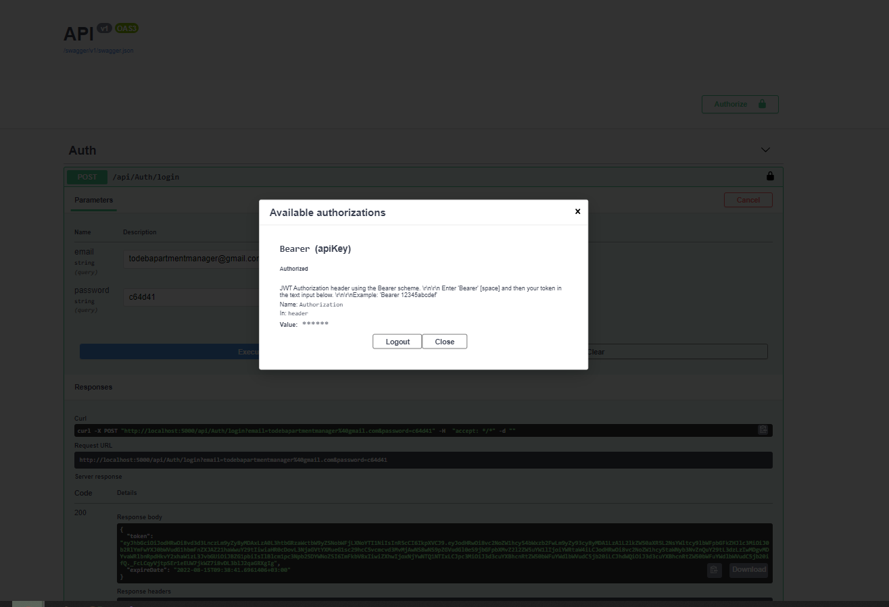

# TODEB .Net Bootcamp Graduation Project
Apartment Management System

## First thing first
- In API layer -> appsettings, input your database name into the MsComm and HangfireConnection. (Sometimes it doesn't create automatically Hangfire Server. Then manually create server. It's name will be "Hangfire")
- Set as startup API Layer, in Nuget Manager Console choose DAL layer and "update-migration".

## About the project

Common using electricity, water, natural gas bills and revenues are add to the residents on a monthly basis through the system by the administrator of a site. Residents can see the bills and revenues what they receive, pay these bills and reevenues with a credit card and send a message to the administrator. The administrator can add, view, edit and delete bills, revenues, flats, users (residents), incoming messages, flat/residence information, contact information, vehicle information.

- The administrator must login (username: todebapartmentmanager@gmail.com, password: 19fb65)
- There is an authentication service for logging into the system. 
- The administrator can add the user information, an automatic password is created and send to the user's e-mail address.
- The administrator can assign users to apartments.
- The administrator can add billing information on a monthly basis.
- The administrator can add monthly revenues information.
- Residents can see their debts and pay with credit card.
- Residents can send messages to the administrator.

## Register Service
The information inputs for the Register process is first validated with the code was written using Fluent Validation, the password is generated, the password is sent to the residents e-mail addresses with using Hangfire (Hangfire uses MsSql database). The generated password is hashed and all user information is saved in the database, together with user permissions. In addition, user permissions are cached and stored in the Redis Database so that the MsSql database is not used continuously in every method invocation.

## Login Service
Before the login process, the password verification process is done. There is also an authentication service for login. Using JWT Token, Token is created and authorized.

## Message Service
Residents can send a message to the admin, message information received from outside is validated with using Fluent Validation. Admin can read and delete incoming messages.

## Payment Service
There are two services as bill payment and revenue payment. After the method runs, the paid bills and revenues are updated in the database as paid, and the credit/debt status of the relevant residence is updated and saved in the database.

## Vehicle, Credit Card, Flat, Resident, Invoice and Dues Services
There are methods of adding, removing, editing and calling for vehicles, credit cards, residences, residents, related bills and revenues. In addition, credit card information is kept in the MongoDb database.

## Test
An integration test was written using xUnit and Fluent Assertions for user registration.

## General
The application is written using .Net 5.
The application is written using layered architecture
 
## ERD Diagram

## Swagger
- Register

- Login

- Authorize
